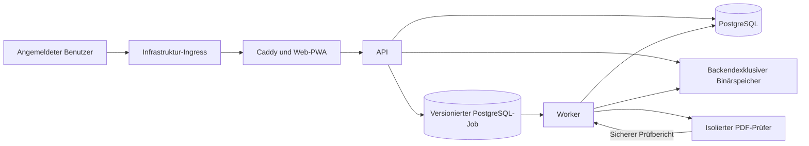

# Architekturübersicht

## Status und Leseregel

Diese Übersicht fasst angenommene ADRs zusammen. Die Entscheidungen sind noch
nicht implementiert; im Repository existiert keine funktionsfähige Anwendung.
Normative technische Details stehen im [ADR-Index](decisions/README.md),
fachliches Verhalten in den [Produktdokumenten](../product/VISION.md).

## Offene technische Verifikationen

Angenommene Technologieentscheidungen sind noch kein Eignungsnachweis. Vor den
jeweils zugeordneten Implementierungs- oder Freigabeschritten bleiben
insbesondere zu verifizieren:

- reproduzierbare Zod-/OpenAPI-3.1-Erzeugung ohne Vertragsdrift,
- Quota-, Persistenz-, IndexedDB-, Web-Crypto- und Browsergrenzen einschließlich
  Safari auf iPadOS,
- Erkennung und Deaktivierung der festgelegten PDF-Merkmale durch qpdf und
  PDF.js,
- `pg-boss` mit kontrollierter externer Schemamigration ohne Runtime-DDL,
- gesicherte Tempo-Ablage für 72 Stunden PRD-Traces innerhalb des Budgets,
- Docker-Compose-V2-, Härtungs- und Kapazitätseignung des privaten Zielhosts.

Diese Punkte sind technische Gates und keine offenen Produkt- oder
Architekturentscheidungen. Die verbindliche Einordnung steht in
[ADR-0003](decisions/ADR-0003-http-api-und-oeffentliche-vertraege.md),
[ADR-0006](decisions/ADR-0006-lokale-pwa-daten-und-offline-synchronisation.md),
[ADR-0007](decisions/ADR-0007-pdf-verarbeitung-und-annotationen.md),
[ADR-0010](decisions/ADR-0010-hintergrundaufgaben-loeschung-und-auditaufbewahrung.md),
[ADR-0011](decisions/ADR-0011-logging-metriken-tracing-und-diagnose.md) und
[ADR-0012](decisions/ADR-0012-container-netz-secrets-und-deployment.md).

## Systemkontext

SoSeBaMa ist eine installierbare responsive PWA. Tablet, Notebook und Desktop
erhalten den vollständigen Primärumfang; Smartphones den im Produktmodell
reduzierten Umfang. Angemeldete Benutzer erreichen je Umgebung genau einen
Anwendungseingang.

Der Infrastruktur-Ingress stellt öffentliches TLS bereit. Caddy ist der interne
Application Gateway. Nur das Backend erreicht Datenbank und Binärspeicher.

## Modularer Monolith und Laufzeitrollen

API und Worker verwenden dieselbe TypeScript-/NestJS-Backendcodebasis und
dieselben Fachregeln. Sie sind getrennte Prozesse mit getrennten technischen
Identitäten. Der Worker ist kein Microservice. Ein separater Migrator führt
kontrollierte Schemamigrationen aus.

Die Fachmodule sind Identität, Bands, Autorisierung, Songs, Inhalte, Dateien,
Overlays, Setlists, Bearbeitung, Synchronisation, Lebenszyklus und Audit. Jedes
Modul besitzt seine Daten und exportiert nur eine Fassade. Modulübergreifende
Schreibabläufe werden durch einen führenden Application Service in einer
expliziten Unit of Work orchestriert.

Das Web verwendet React 19 und Vite als CSR/PWA. API und Worker verwenden
NestJS 11 auf Node.js 24 LTS. Das pnpm-Monorepo teilt nur öffentliche
technische Verträge und Validierung. Serverinterne Autorisierung,
Datenbankmodelle, Eigentum, Audit und Secrets gelangen nicht in den Client.
Details stehen in [ADR-0001](decisions/ADR-0001-systemarchitektur-und-laufzeitrollen.md),
[ADR-0002](decisions/ADR-0002-typescript-technologiestack-und-monorepo.md)
und [ADR-0014](decisions/ADR-0014-modulstruktur-und-walking-skeleton.md).

## Web, API, Worker und PDF-Prüfer

Die REST/JSON-API liegt unter `/api/v1`. Zod validiert öffentliche Verträge;
OpenAPI 3.1 wird reproduzierbar erzeugt. ETag, `If-Match`, Idempotency Keys und
Problem Details machen Wiederholung und Konflikte explizit. Autorisierung wird
vor Pagination, Counts und Facetten angewendet.

Die API nimmt Upload und Quarantäne kontrolliert an. Fachzustand, Revision,
Audit und der versionierte PDF-Prüfjob entstehen in einer Transaktion. Der
Worker entnimmt den Job aus PostgreSQL und übergibt die Quarantänedatei an den
isolierten PDF-Prüfer. Der reguläre Prüfpfad ist damit API → PostgreSQL-Job →
Worker → PDF-Prüfer; die schwere PDF-Prüfung läuft nicht im normalen
HTTP-Request-Prozess. Allgemeine PostgreSQL-Jobs verarbeitet der Worker
ebenfalls versioniert und idempotent. Ein externer Broker ist im MVP nicht
vorgesehen.

Der PDF-Prüfer ist ein zustandsloser isolierter Container ohne Internet,
Datenbank, App-Sitzungen oder Secrets. Eine versionierte strikte Allowlist mit
Default-Deny akzeptiert ausschließlich unterstützte und sicher klassifizierte
PDF-Strukturen. Unbekannte oder nicht sicher klassifizierbare Strukturen werden
abgelehnt. Der blockierende Eignungsnachweis für qpdf und PDF.js erfolgt vor
AP-04. Der Prüfer arbeitet unter begrenzten Ressourcen und liefert nur einen
sicheren Bericht. Er schreibt keinen Fachzustand fort. Der Worker verarbeitet
den Bericht mit den aktuellen Fach- und Autorisierungsregeln und führt die
autorisierte Statusfortschreibung aus. Die API ruft den Prüfer nicht direkt
auf. Workerparallelität und Ressourcenbudget bleiben im
[Ressourcenbudget](RESOURCE-BUDGET.md) unverändert.

## PostgreSQL, Binärspeicher und Suche

PostgreSQL 18 speichert relationalen Fachzustand, monotone `bigint`-Revisionen,
Audit und Jobs. DEV, TST und PRD besitzen jeweils einen eigenen
PostgreSQL-Dienst beziehungsweise eine eigene PostgreSQL-Instanz und teilen
weder PostgreSQL-Instanz noch PostgreSQL-Cluster. UUIDv7 ist die
fachlich-technische ID. Prisma ORM 7 und Prisma Migrate sind Standardzugriff
und Migrationsweg.

PDFs liegen in einem backendexklusiven persistenten Volume hinter einer
Object-Store-Schnittstelle. PostgreSQL führt Metadaten, Hash und Status.
Datenbank und Dateien werden zusammen gesichert und wiederhergestellt.
PostgreSQL Full Text Search und `pg_trgm` decken die MVP-Suche ab.

## Sicherheits- und Netzwerkgrenzen

DEV, TST und PRD besitzen getrennte Daten, Secrets, Identitäten, Volumes, Netze
und Telemetriespeicher. Netze trennen Edge, Anwendung, Daten, Validierung und
Observability. Datenbank, API, Worker, Migrator und Validator veröffentlichen
keine Hostports. Es gibt keinen Docker-Socket und kein Hostnetz.

Eigene Container laufen nicht privilegiert, nicht als Root, mit read-only
Root-Dateisystem, ohne Capabilities und mit `no-new-privileges`. Secrets liegen
nur als hostgeschützte servicespezifische Dateien vor. Reale
Infrastrukturwerte stehen nicht im Repository.

TST darf einen getrennten geschützten Diagnosepfad besitzen. In PRD fehlen
Diagnoseroute, Swagger und Debugports technisch. Siehe
[ADR-0012](decisions/ADR-0012-container-netz-secrets-und-deployment.md).

## Authentifizierung und Autorisierung

Das Backend verwaltet lokale Identitäten. Bestätigte E-Mail-Adresse und
Anzeigename sind getrennt. Es gibt keine offene Selbstregistrierung.
Argon2id schützt Passwörter. WebAuthn und TOTP unterstützen MFA; MFA ist für
Plattformadministratoren verpflichtend.

Sitzungen sind opak, serverseitig in PostgreSQL gespeichert und widerrufbar.
Der Browser verwendet ein sicheres HttpOnly-SameSite-Cookie. Web und API laufen
Same-Origin. Origin-Prüfung, CSRF-Nachweis und Step-up schützen kritische
Aktionen.

Eine typisierte Policy-Engine prüft Subjekt, Objektzustand, Ausnahmen, globale
und objektbezogene Rechte, Integrität, Audit und Transaktion in fester
Reihenfolge. Unsichtbare Einzelobjekte ergeben 404. Auditpflichtige Aktionen
werden nur zusammen mit ihrem Audit festgeschrieben.

Das delegierbare Recht `Nutzer einladen` ist nicht Teil des Basissatzes von
`Alle Benutzer`. Nach gültiger Einladung aktiviert das System ein normales
Konto mit ausschließlich diesem Basissatz. Der Einladende besitzt dadurch
keine manuelle Aktivierungs- oder Rechtevergabebefugnis.

## Online- und Offlinepfade

IndexedDB mit Dexie speichert autorisierte Serverstände, eigene Entwürfe,
Outbox, Cursor, Offline-Grants und verschlüsselte PDF-Blöcke in getrennten
Bereichen. Fachliche Daten liegen weder in `localStorage` noch in der Cache API.
Der Service Worker cached nur Anwendungsshell und öffentliche Assets.

Ein zeitbegrenzter Offline-Grant ist kein Onlinesitzungstoken. PDFs werden
lokal blockweise mit AES-GCM-256 verschlüsselt. Der verbindliche Syncweg läuft
im Vordergrund über idempotente Outbox-Befehle und Servercursor. Offlineumfang
wird bewusst vorbereitet; es gibt keine automatische Vollspiegelung.

## Check-outs

Eine `EditSession` ist von Login- und Gerätesitzung getrennt. Ein persistenter
`EditCheckout` erlaubt höchstens eine aktive Speichersitzung je gemeinsam
bearbeitbarem Objekt. Die initiale Lease dauert zwei Minuten; Heartbeats
erfolgen alle 30 Sekunden. Nach Ablauf gibt es weder stilles Speichern noch
stilles Neuerwerben.

Jeder Save prüft Sitzung, Check-out, Lease, Rechte, Löschstatus, Revision und
Fachinvarianten atomar. REST bleibt Wahrheitsquelle. SSE liefert nur Hinweise,
Polling den Fallback.

## Jobs, Löschung und Audit

Für versionierte PostgreSQL-Jobs ist `pg-boss` ohne Runtime-DDL vorgesehen.
Die konkrete Integrationsfähigkeit und das kontrolliert migrierte Queue-Schema
bleiben vor der ersten jobgestützten PDF-Prüfung in AP-04 blockierend zu
verifizieren.

Löschung durchläuft explizite Zustände von aktiv über Löschvormerkung und
Finalisierung bis abgeschlossen oder fehlgeschlagen. Fristablauf richtet sich
nach Server- und Datenbankzeit. Technische Verzögerung verlängert keine
Wiederherstellung. Datenbankfinalisierung erfolgt vor Binärbereinigung.

Audit ist append-only und von Fachhistorie und Telemetrie getrennt.
Aufbewahrungsfristen folgen dem Produktmodell und
[ADR-0010](decisions/ADR-0010-hintergrundaufgaben-loeschung-und-auditaufbewahrung.md).

## Telemetrie

Pino liefert redigierte JSON-Logs. OpenTelemetry liefert Backendtraces und
Metriken über W3C Trace Context. Metriken sind Prometheus-kompatibel und niedrig
kardinal. Grafana Alloy sammelt für Prometheus, Loki, Tempo und Grafana.

Jede Umgebung besitzt eigene Telemetrieidentitäten und -speicher. Ein
Telemetrieausfall blockiert keine Fachtransaktion; ein Auditausfall blockiert
auditpflichtige Fachaktionen. Retention und Volumes stehen im
[Ressourcenbudget](RESOURCE-BUDGET.md).

## Deployment und Promotion

Docker Compose V2 betreibt getrennte Projekte für DEV, TST und PRD. Drei Images
decken Web, Backend und PDF-Prüfer ab. Dasselbe unveränderliche Imagebundle wird
per SHA-256-Digest DEV → TST → PRD promoviert. `latest` ist ausgeschlossen.

Ein Releasemanifest verbindet Version, Commit, Digests, Schema, Verträge, SBOM,
Provenienz und Attestierung. Ein separater Migrator verändert das Schema.
Merge, Release und PRD-Deployment sind getrennte Schritte mit separater
Ownerfreigabe.

## Test- und Lieferkette

Vitest, React Testing Library, Playwright und reale PostgreSQL-Integration über
Testcontainers decken Unit-, Vertrags-, Integrations-, Komponenten-, Browser-
und Systemtests ab. CI prüft zusätzlich OpenAPI, Migrationen, Compose,
Container, Abhängigkeiten, Secrets, Policies, SBOM, Provenienz und
Attestierungen.

GitHub-hosted Runner führen Repositorycode aus. Fremder PR-Code erreicht keine
selbst gehosteten Runner oder Secrets. TST ergänzt reale Safari-/iPadOS-,
Performance-, Ressourcen- und Wiederherstellungsprüfungen. Die Reihenfolge und
Abnahmegates stehen in der
[Implementierungsroadmap](IMPLEMENTATION-ROADMAP.md).
